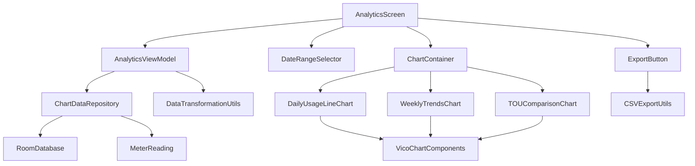

# Analytics Screen Implementation Plan

## Overview
This plan outlines the implementation of a comprehensive analytics screen for the LECO Solar Meter Analyzer app, featuring interactive charts, data visualization, and export functionality.

## Architecture Overview



## Implementation Tasks

### 1. AnalyticsViewModel
- **Purpose**: Manage chart data, business logic, and UI state
- **Key Features**:
  - Fetch and transform meter readings for chart data
  - Handle date range filtering
  - Manage loading states and error handling
  - Provide data for CSV export
- **State Management**:
  - `isLoading: Boolean`
  - `error: String?`
  - `selectedDateRange: DateRange`
  - `chartData: Map<ChartType, List<ChartDataPoint>>`

### 2. Chart Components
#### Daily Usage Line Chart
- **Data Structure**: Time series of daily total consumption
- **Vico Configuration**:
  - Line chart with smooth curves
  - X-axis: Dates
  - Y-axis: Consumption (kWh)
  - Interactive tooltips showing exact values
- **Features**:
  - Zoom and pan capabilities
  - Trend line overlay option
  - Value highlighting on hover

#### Weekly Trends Bar + Line Chart
- **Data Structure**: Weekly consumption patterns
- **Vico Configuration**:
  - Bar chart for daily consumption
  - Line overlay for weekly average
  - Grouped by weeks
- **Features**:
  - Compare current week vs previous week
  - Show consumption trends
  - Interactive legend

#### TOU Comparison Stacked Bar Chart
- **Data Structure**: Time-of-usage breakdown
- **Vico Configuration**:
  - Stacked bars for each time period
  - Three segments: Off-Peak, Day, Peak
  - Color-coded by time period
- **Features**:
  - Show percentage breakdown
  - Compare different time periods
  - Interactive segment highlighting

### 3. Date Range Selection
- **Component**: Custom date picker
- **Options**:
  - Preset ranges: Last 7 days, Last 30 days, Last 3 months, Last year
  - Custom date range selection
  - Quick filter buttons
- **Features**:
  - Material 3 styling
  - Responsive layout
  - Validation for date ranges

### 4. CSV Export Functionality
- **Features**:
  - Export all chart data
  - Export specific chart data
  - Include metadata (date range, total readings)
  - UTF-8 encoding with proper headers
- **Format**:
  ```csv
  Date,Total Usage (kWh),Rate 1 (kWh),Rate 2 (kWh),Rate 3 (kWh),Notes
  2024-01-01,25.5,10.2,8.3,7.0,"Normal usage"
  ```

### 5. Material 3 Chart Containers
- **Design**:
  - Consistent card styling
  - Proper spacing and padding
  - Elevation and shadows
  - Responsive layout
- **Components**:
  - `ChartCard` wrapper
  - `ChartHeader` with title and actions
  - `ChartFooter` with legend and controls

### 6. Interactive Features
- **Tooltips**: Show detailed information on chart interaction
- **Zoom/Pan**: Navigate through large datasets
- **Legend**: Toggle data series visibility
- **Value Highlighting**: Emphasize specific data points
- **Animation**: Smooth transitions between data updates

### 7. Data Transformation Utilities
- **Purpose**: Convert raw meter readings to chart-ready data
- **Functions**:
  - `transformToDailyData()`: Aggregate readings by day
  - `transformToWeeklyData()`: Aggregate readings by week
  - `transformToTOUData()`: Calculate time-of-usage breakdown
  - `calculateTrends()`: Calculate consumption trends
  - `formatChartData()`: Format data for Vico charts

### 8. Error Handling & Loading States
- **Loading States**:
  - Skeleton loaders for charts
  - Progress indicators for data fetching
  - Smooth transitions during updates
- **Error Handling**:
  - Network error handling
  - Empty state handling
  - Data validation errors
  - User-friendly error messages

### 9. Responsive Design
- **Tablet Layout**: Multi-column chart arrangement
- **Phone Layout**: Single column with scrolling
- **Adaptive Spacing**: Adjust padding and margins
- **Text Scaling**: Responsive typography

## Technical Implementation Details

### Dependencies
- Vico chart library (already included)
- Kotlin coroutines for async operations
- Room database for data persistence
- Material 3 components for UI consistency

### Data Flow
1. User selects date range
2. AnalyticsViewModel fetches data from repository
3. Data transformation utilities process readings
4. Chart components render transformed data
5. User interactions update view state

### Performance Considerations
- Efficient data queries with date range filtering
- Lazy loading for large datasets
- Chart data caching
- Smooth animations with proper frame rates

## File Structure
```
app/src/main/java/com/leco/meterreader/
├── viewmodel/
│   └── AnalyticsViewModel.kt
├── ui/screens/analytics/
│   └── AnalyticsScreen.kt
├── ui/components/
│   ├── charts/
│   │   ├── DailyUsageLineChart.kt
│   │   ├── WeeklyTrendsChart.kt
│   │   ├── TOUComparisonChart.kt
│   │   └── ChartContainer.kt
│   ├── DateRangeSelector.kt
│   └── ChartLegend.kt
├── util/
│   ├── ChartDataUtils.kt
│   └── CSVExportUtils.kt
└── data/repository/
    └── AnalyticsRepository.kt
```

## Testing Strategy
- Unit tests for data transformation
- Integration tests for chart rendering
- UI tests for user interactions
- Performance tests for large datasets

## Success Criteria
- All three chart types render correctly
- Date range selection works properly
- CSV export generates valid files
- Charts are responsive and interactive
- Loading states and errors handled gracefully
- Performance meets requirements