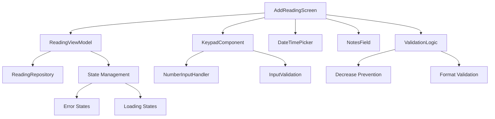

# Manual Reading Entry Screen Implementation Plan

## Overview
This plan outlines the implementation of a comprehensive manual reading entry screen for the LECO Solar Meter Analyzer Android app using Jetpack Compose. The screen will feature a large numeric keypad, timestamp selection with smart defaults, validation logic, and a polished Material 3 UI.

## Architecture Overview



## Component Breakdown

### 1. AddReadingScreen (Main Component)
**Location**: `app/src/main/java/com/leco/meterreader/ui/screens/reading/AddReadingScreen.kt`

**Responsibilities**:
- Main screen orchestration
- Layout management with responsive design
- State coordination between components
- Navigation handling

**Key Features**:
- Material 3 design with proper spacing
- Responsive layout for different screen sizes
- Top app bar with title and navigation
- Error state management
- Loading states

### 2. ReadingViewModel
**Location**: `app/src/main/java/com/leco/meterreader/viewmodel/ReadingViewModel.kt`

**Responsibilities**:
- State management for reading data
- Validation logic
- Business rules enforcement
- Repository communication

**State Variables**:
```kotlin
data class ReadingUiState(
    val totalReading: String = "",
    val rate1Reading: String = "",
    val rate2Reading: String = "",
    val rate3Reading: String = "",
    val timestamp: LocalDateTime = LocalDateTime.now(),
    val notes: String = "",
    val errors: Map<String, String> = emptyMap(),
    val isLoading: Boolean = false,
    val isSaved: Boolean = false
)
```

### 3. Numeric Keypad Component
**Location**: `app/src/main/java/com/leco/meterreader/ui/components/KeypadComponent.kt`

**Responsibilities**:
- Large numeric keypad display
- Input handling and formatting
- Backspace functionality
- Clear button

**Layout**:
- 3x4 grid of number buttons (0-9)
- Large, tappable buttons
- Backspace button
- Clear button
- Decimal point support

### 4. DateTimePicker Component
**Location**: `app/src/main/java/com/leco/meterreader/ui/components/DateTimePicker.kt`

**Responsibilities**:
- Smart timestamp defaults
- Date/time selection UI
- Format validation
- Time zone handling

**Smart Defaults**:
- Current time as default
- Prevent future timestamps
- Smart rounding to nearest 15 minutes
- Last reading time as reference

### 5. Notes Field Component
**Location**: `app/src/main/java/com/leco/meterreader/ui/components/NotesField.kt`

**Responsibilities**:
- Optional notes input
- Character limit enforcement
- Multi-line support
- Auto-resize behavior

### 6. Validation Logic
**Location**: `app/src/main/java/com/leco/meterreader/util/ValidationUtils.kt`

**Validation Rules**:
1. **Non-decrease validation**: New readings must be >= previous readings
2. **Format validation**: Must be valid numeric format
3. **Range validation**: Must be within reasonable bounds
4. **Required fields**: Total reading is mandatory

**Error States**:
- Reading decreased from previous
- Invalid numeric format
- Empty required fields
- Out of range values

## Implementation Steps

### Phase 1: Core Structure
1. Create `AddReadingScreen` component
2. Implement basic layout structure
3. Add Material 3 styling
4. Create `ReadingViewModel` with basic state management

### Phase 2: Input Components
1. Implement `KeypadComponent`
2. Add number input handling
3. Create `DateTimePicker` with smart defaults
4. Add `NotesField` component

### Phase 3: Validation Logic
1. Implement validation utilities
2. Add real-time validation feedback
3. Create decrease prevention logic
4. Add error state management

### Phase 4: Polish & UX
1. Add animations and transitions
2. Implement responsive layout
3. Add loading states
4. Create save/cancel workflow

## Data Models

### Reading Data Class
```kotlin
data class MeterReading(
    val id: String = UUID.randomUUID().toString(),
    val timestamp: LocalDateTime,
    val totalReading: Double,
    val rate1Reading: Double,
    val rate2Reading: Double,
    val rate3Reading: Double,
    val notes: String = "",
    val createdAt: LocalDateTime = LocalDateTime.now()
)
```

### Repository Interface
```kotlin
interface ReadingRepository {
    suspend fun saveReading(reading: MeterReading): Result<MeterReading>
    suspend fun getLatestReading(): Result<MeterReading?>
    suspend fun getAllReadings(): Result<List<MeterReading>>
}
```

## UI/UX Considerations

### Design Principles
- **Accessibility**: Large touch targets, clear contrast
- **Consistency**: Follow Material 3 guidelines
- **Feedback**: Real-time validation, clear error messages
- **Efficiency**: Smart defaults, intuitive input flow

### Layout Structure
```
┌─────────────────────────────────────┐
│ Top App Bar                         │
├─────────────────────────────────────┤
│ Timestamp Selector                  │
├─────────────────────────────────────┤
│ Reading Input Fields                │
│ ┌─────────────────────────────────┐ │
│ │ Total Reading Display           │ │
│ │ [Large numeric input area]      │ │
│ └─────────────────────────────────┘ │
│ ┌─────────────────────────────────┐ │
│ │ Rate 1, 2, 3 Inputs             │ │
│ └─────────────────────────────────┘ │
├─────────────────────────────────────┤
│ Numeric Keypad                     │
├─────────────────────────────────────┤
│ Notes Field                        │
├─────────────────────────────────────┤
│ Action Buttons (Save/Cancel)        │
└─────────────────────────────────────┘
```

## Error Handling Strategy

### Error Types
1. **Validation Errors**: Invalid input, decrease detection
2. **Network Errors**: Save failures
3. **System Errors**: Database issues

### Error Display
- Inline error messages for immediate feedback
- Toast notifications for critical errors
- Loading indicators during save operations

## Performance Considerations

### Optimization Strategies
- Lazy loading for components
- Debounced input validation
- Efficient state management
- Minimal recomposition

## Testing Strategy

### Unit Tests
- ViewModel state management
- Validation logic
- Repository operations

### Integration Tests
- Component interactions
- Navigation flow
- Error scenarios

### UI Tests
- User interaction flows
- Validation feedback
- Responsive behavior

## Dependencies

### Additional Dependencies (if needed)
- `androidx.lifecycle:lifecycle-viewmodel-compose`
- `androidx.navigation:navigation-compose`
- `coil-compose` for image loading (if needed)
- `accompanist-systemuicontroller` for system UI

## Timeline

This implementation will be completed in phases, with each phase building upon the previous one. The focus will be on creating a robust, user-friendly interface that follows Material 3 design principles and provides excellent user experience.

## Success Criteria

1. ✅ Large numeric keypad with proper touch targets
2. ✅ Smart timestamp selection with sensible defaults
3. ✅ Robust validation preventing invalid readings
4. ✅ Material 3 design with proper spacing and typography
5. ✅ Responsive layout for different screen sizes
6. ✅ Smooth animations and transitions
7. ✅ Comprehensive error handling and user feedback
8. ✅ Optional notes field with proper input handling
9. ✅ Save/cancel workflow with proper state management
10. ✅ Real-time validation feedback