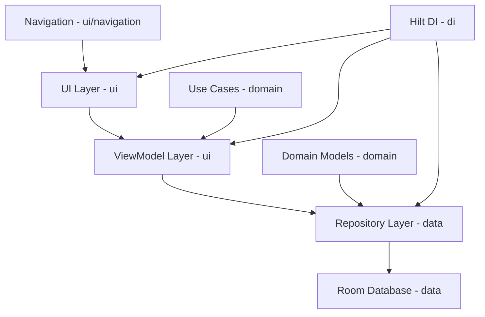

# Milestone 1.1: Project Foundation & Architecture

## Overview

Create the Android project skeleton with modern tooling for the LECO Smart Meter Analyzer app.

## Architecture Diagram



## File Structure

```
app/
├── src/main/
│   ├── java/com/leco/meterreader/
│   │   ├── MeterReaderApplication.kt
│   │   ├── di/
│   │   │   ├── DatabaseModule.kt
│   │   │   └── RepositoryModule.kt
│   │   ├── data/
│   │   │   ├── local/
│   │   │   │   ├── MeterReadingDao.kt
│   │   │   │   ├── TariffConfigDao.kt
│   │   │   │   └── AppDatabase.kt
│   │   │   ├── repository/
│   │   │   │   ├── MeterReadingRepository.kt
│   │   │   │   └── TariffConfigRepository.kt
│   │   │   └── model/
│   │   │       ├── MeterReadingEntity.kt
│   │   │       └── TariffConfigEntity.kt
│   │   ├── domain/
│   │   │   ├── model/
│   │   │   │   ├── MeterReading.kt
│   │   │   │   └── TariffConfig.kt
│   │   │   └── repository/
│   │   │       ├── MeterReadingRepository.kt
│   │   │       └── TariffConfigRepository.kt
│   │   └── ui/
│   │       ├── navigation/
│   │       │   └── NavGraph.kt
│   │       ├── theme/
│   │       │   ├── Theme.kt
│   │       │   └── Color.kt
│   │       ├── MainScreen.kt
│   │       └── MainActivity.kt
│   ├── res/
│   │   ├── values/
│   │   │   ├── themes.xml
│   │   │   └── colors.xml
│   │   └── drawable/
│   │       └── ic_launcher_foreground.xml
│   └── AndroidManifest.xml
├── build.gradle (app level)
└── proguard-rules.pro
```

## Dependencies

### Core
- Kotlin 1.9.x
- Compose BOM 2024.x
- Material 3
- AndroidX Core KTX

### Database
- Room Runtime + KTX + Compiler
- Room Paging (for future use)

### Dependency Injection
- Hilt Android
- Hilt Navigation Compose
- Hilt Compiler

### Architecture
- Lifecycle ViewModel Compose
- Navigation Compose

### Testing
- JUnit 4
- Mockito
- Room Testing
- Hilt Testing

## Implementation Steps

### Step 1: Project Configuration
- [ ] Create `settings.gradle` with project name
- [ ] Create `build.gradle` (project level) with classpaths
- [ ] Create `build.gradle` (app level) with all dependencies

### Step 2: AndroidManifest & Application
- [ ] Create `AndroidManifest.xml` with MainActivity declaration
- [ ] Create `MeterReaderApplication.kt` with @HiltAndroidApp

### Step 3: Theme Setup
- [ ] Create `Color.kt` with Material 3 color scheme
- [ ] Create `Theme.kt` with Material 3 theme

### Step 4: Package Structure
- [ ] Create `data/local/` for Room database
- [ ] Create `data/model/` for entities
- [ ] Create `data/repository/` for data layer
- [ ] Create `domain/model/` for domain models
- [ ] Create `domain/repository/` for repository interfaces
- [ ] Create `ui/` for Compose screens
- [ ] Create `ui/navigation/` for navigation
- [ ] Create `ui/theme/` for theme files
- [ ] Create `di/` for Hilt modules

### Step 5: Hilt Configuration
- [ ] Create `DatabaseModule.kt` for Room database provision
- [ ] Create `RepositoryModule.kt` for repository binding

### Step 6: Navigation
- [ ] Create `NavGraph.kt` with sealed class routes
- [ ] Create `MainScreen.kt` with Scaffold

### Step 7: Domain Models
- [ ] Create `MeterReading.kt` domain model
- [ ] Create `TariffConfig.kt` domain model
- [ ] Create repository interfaces

## Key Design Decisions

1. **Clean Architecture**: Clear separation between data, domain, and UI layers
2. **Hilt DI**: Constructor injection for ViewModels and Repositories
3. **Compose Navigation**: Type-safe navigation with sealed classes
4. **Material 3**: Dynamic color support with seed color
5. **Room Database**: Entities in data layer, domain models in domain layer

## Questions for Clarification

1. Should I use Kotlin 1.9.x or wait for 2.0?
2. Any preference for minSdk version? (Recommended: 24 for wide compatibility)
3. Should I include Vico Charts dependency now or add later?
4. Any specific app icon or branding colors to use?