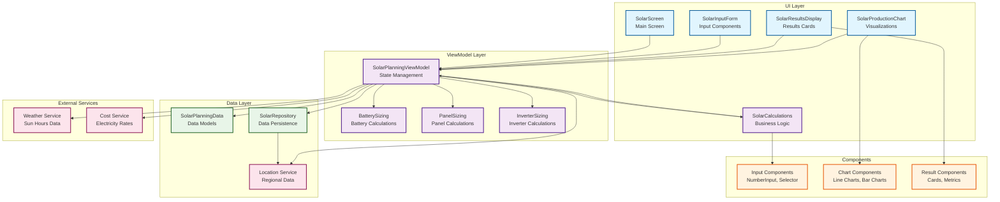
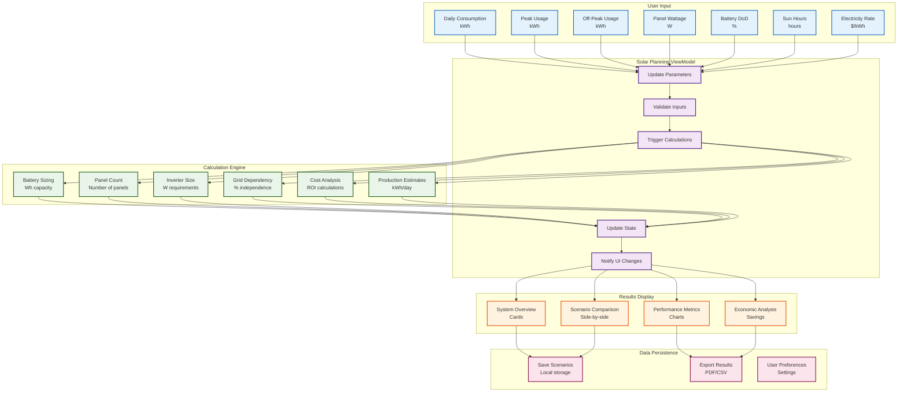
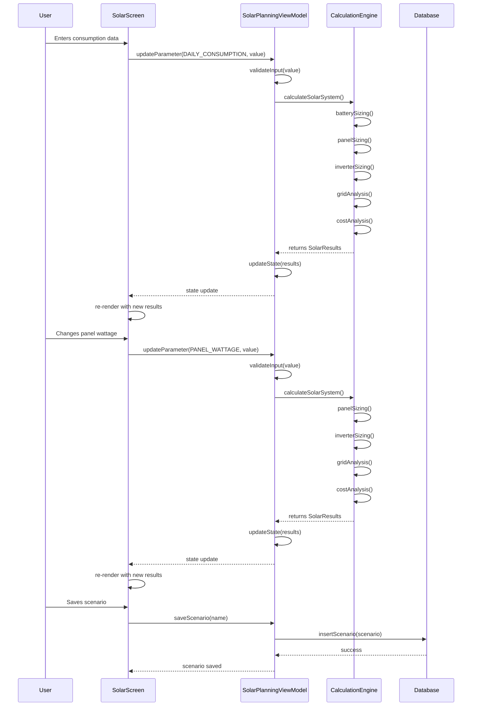
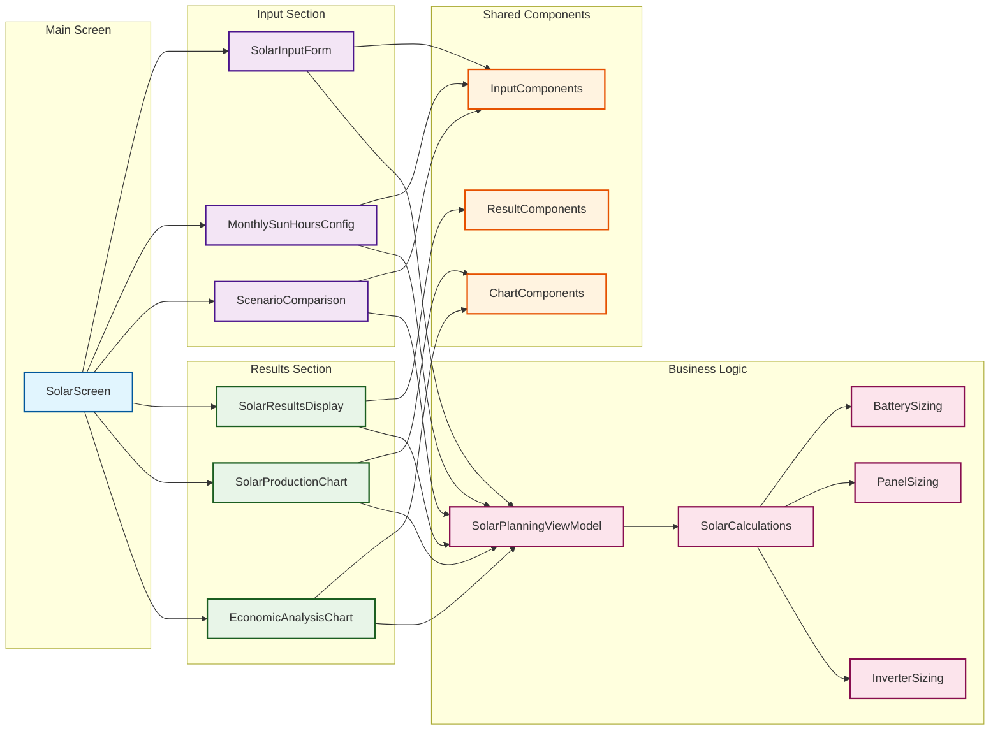
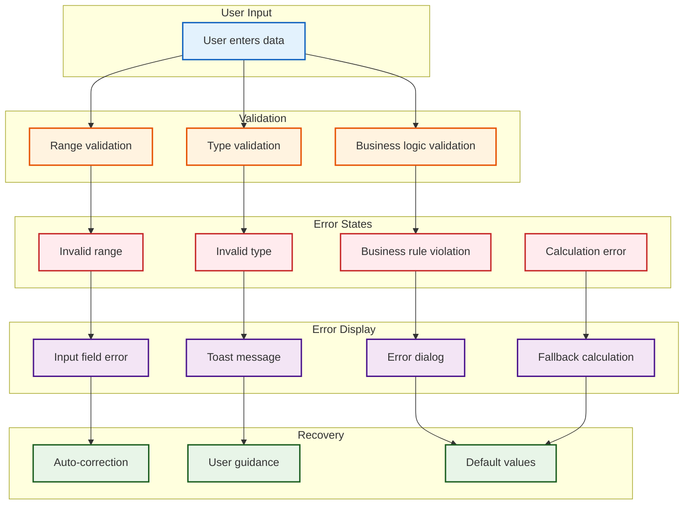
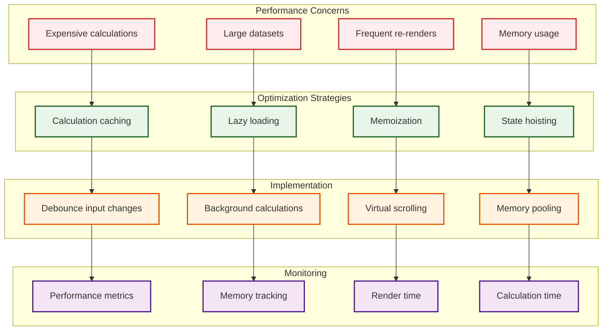

# Solar Planning Screen Architecture

## System Architecture Diagram

## Data Flow Diagram

## State Management Flow

## Component Interaction Diagram

## Error Handling Flow

## Performance Optimization Flow

These diagrams provide a comprehensive view of the solar planning screen architecture, data flow, component interactions, error handling, and performance optimization strategies. They serve as a blueprint for implementation and help ensure all aspects of the system are properly designed and integrated.