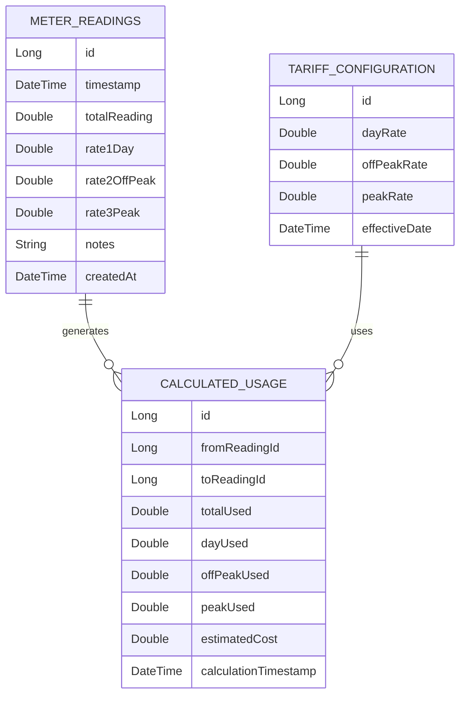
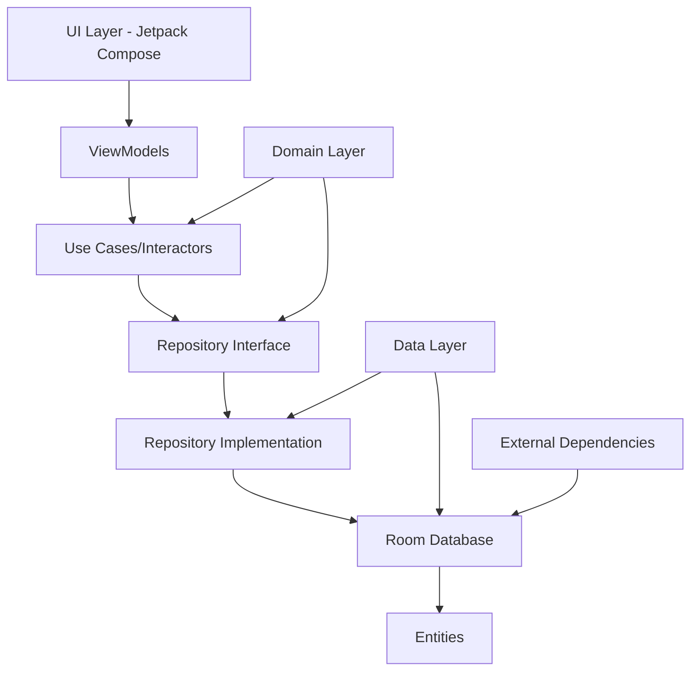
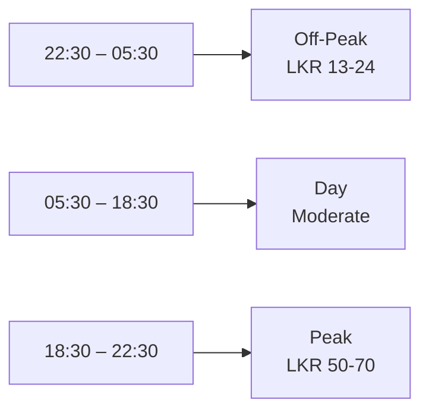

# LECO Solar Meter Analyzer - Active Context

## Project Overview
**Objective**: Build a simple but scalable Android application for personal electricity usage tracking and solar planning analysis.

### Core Requirements
- Capture LECO smart meter readings twice daily (manual entry)
- Store data locally on Android device using Room Database
- Calculate electricity usage patterns and TOU costs
- Produce graphs and analytics using Vico Charts
- Estimate electricity costs using LECO TOU tariffs
- Help size future off-grid or hybrid solar installations

### Technical Stack
- **Language**: Kotlin
- **UI Framework**: Jetpack Compose with Material 3
- **Architecture**: MVVM
- **Database**: Room Database with coroutines and Flow
- **Charts**: Vico Charts
- **Platform**: Android (Phone, Portrait orientation)

### User Model
- Single user only
- Offline-first approach
- No login/accounts
- Local-only storage
- Manual data entry only (Phase 1)

---

## Development Phases & Milestones

### 🎯 Milestone 1: Core Application Architecture
**Priority**: Critical - Foundation for entire app

#### 1.1 Project Setup & Structure
- [ ] Create Android Studio project with Kotlin + Jetpack Compose
- [ ] Set up Material 3 theme and navigation
- [ ] Implement clean architecture layers (Domain, Data, Presentation)
- [ ] Configure dependency injection (Hilt or Koin)
- [ ] Set up build.gradle with required dependencies

#### 1.2 Database Layer Implementation
- [ ] Create Room entities for MeterReadings, CalculatedUsage, TariffConfiguration
- [ ] Implement DAOs with coroutines and Flow
- [ ] Create database class with migrations
- [ ] Build Repository pattern for data access
- [ ] Implement data validation rules

#### 1.3 Core Data Models
- [ ] MeterReading entity with timestamp and 4 rate readings
- [ ] CalculatedUsage entity for derived consumption data
- [ ] TariffConfiguration entity for configurable rates
- [ ] Domain models for business logic
- [ ] DTOs for UI communication

---

### 📊 Milestone 2: Data Entry & Basic Functionality
**Priority**: High - Core user workflow

#### 2.1 Manual Entry Screen
- [ ] Create AddReadingScreen with Jetpack Compose
- [ ] Implement large numeric keypad for meter readings
- [ ] Add timestamp selection with smart defaults
- [ ] Implement validation logic (readings must not decrease)
- [ ] Add notes field with optional input
- [ ] Create save/cancel workflow with error handling

#### 2.2 Dashboard Screen
- [ ] Display latest reading with timestamp
- [ ] Show daily usage calculations
- [ ] Display estimated daily cost
- [ ] Add quick stats (total readings, average usage)
- [ ] Implement navigation to other screens

#### 2.3 History Screen
- [ ] List all meter readings in chronological order
- [ ] Implement swipe-to-delete functionality
- [ ] Add search/filter capabilities
- [ ] Show reading details on tap
- [ ] Implement pagination for large datasets

#### 2.4 Reading Detail Screen
- [ ] Display individual reading with all 4 rates
- [ ] Show usage calculations from previous reading
- [ ] Display cost breakdown by TOU category
- [ ] Show validation warnings if applicable
- [ ] Add edit/delete functionality

---

### 📈 Milestone 3: Analytics & Cost Estimation
**Priority**: High - Value-added features

#### 3.1 Analytics Screen
- [ ] Implement daily usage line chart
- [ ] Create weekly trends bar + line combination chart
- [ ] Add TOU comparison stacked bar chart
- [ ] Implement interactive chart features
- [ ] Add date range selection
- [ ] Export chart data to CSV

#### 3.2 Cost Analysis Screen
- [ ] Calculate daily electricity cost estimates
- [ ] Generate monthly projected bills
- [ ] Show TOU category cost breakdown
- [ ] Display historical cost trends
- [ ] Implement configurable tariff settings
- [ ] Add cost comparison features

#### 3.3 Validation Engine
- [ ] Implement reading validation (non-decreasing values)
- [ ] Add delta calculation automation
- [ ] Create total vs rate sum validation
- [ ] Implement duplicate detection
- [ ] Add anomaly detection for unusual spikes
- [ ] Create modular validation rule system

---

### ☀️ Milestone 4: Solar Planning Features
**Priority**: High - Unique selling proposition

#### 4.1 Solar Planner Screen
- [ ] Create input fields for solar planning parameters
- [ ] Implement battery sizing calculations
- [ ] Add solar panel sizing algorithms
- [ ] Calculate inverter requirements
- [ ] Implement grid dependency analysis
- [ ] Add solar offset estimation

#### 4.2 Usage Analysis Engine
- [ ] Calculate average daily usage
- [ ] Implement day vs night usage analysis
- [ ] Add peak consumption identification
- [ ] Create usage pattern recognition
- [ ] Generate consumption forecasts
- [ ] Add seasonal adjustment factors

#### 4.3 Solar Configuration
- [ ] Implement configurable solar assumptions
- [ ] Add sun hours configuration
- [ ] Set battery depth of discharge parameters
- [ Configure system efficiency factors
- [ ] Add solar panel wattage options
- [ ] Create scenario comparison tools

---

### 🎨 Milestone 5: UI/UX Polish & Export
**Priority**: Medium - User experience

#### 5.1 UI Enhancements
- [ ] Implement Material 3 design system
- [ ] Add dark mode support
- [ ] Create smooth animations and transitions
- [ ] Add loading states and error handling
- [ ] Implement responsive layouts
- [ ] Add accessibility features

#### 5.2 Export Functionality
- [ ] Implement CSV export for raw readings
- [ ] Add calculated usage export
- [ ] Create cost calculation export
- [ ] Export solar analysis summaries
- [ ] Add date range selection for exports
- [ ] Implement share functionality

#### 5.3 Navigation & Flow
- [ ] Implement bottom navigation bar
- [ ] Add screen transitions
- [ ] Create consistent navigation patterns
- [ ] Add back navigation handling
- [ ] Implement deep linking for specific readings
- [ ] Create search functionality across screens

---

### 🔧 Milestone 6: Advanced Features (Future)
**Priority**: Low - Enhancement opportunities

#### 6.1 Smart Features
- [ ] OCR meter scanning integration
- [ ] Automatic reminder notifications
- [ ] Weather API integration
- [ ] AI anomaly detection
- [ ] Usage pattern recommendations

#### 6.2 Integration Features
- [ ] Cloud backup functionality
- [ ] Multi-device sync capabilities
- [ ] Home Assistant integration
- [ ] MQTT smart meter integration
- [ ] BLE/WiFi smart meter sync

#### 6.3 Business Intelligence
- [ ] ROI/payback calculator
- [ ] Solar production simulation
- [ ] Exportable professional reports
- [ ] Cost optimization recommendations
- [ ] Usage benchmarking

---

## Key Architectural Decisions

### Database Schema

### Application Architecture

### TOU Categories & Timing

---

## Critical Success Factors

1. **Data Accuracy**: Validation rules must prevent invalid meter readings
2. **Performance**: Offline-first with efficient local database queries
3. **User Experience**: Fast, intuitive manual entry with large numeric keypad
4. **Solar Planning**: Accurate sizing calculations based on real usage patterns
5. **Maintainability**: Clean architecture for future enhancements

## Risk Mitigation

- **Data Validation**: Implement strict validation to prevent calculation errors
- **Performance**: Optimize database queries for large datasets
- **User Adoption**: Focus on simple, fast data entry workflow
- **Solar Accuracy**: Validate calculations against industry standards
- **Maintainability**: Use modular architecture for easy feature additions

---

## Next Steps

1. Review and approve this architectural plan
2. Begin with Milestone 1: Project Setup & Structure
3. Implement core database layer
4. Build manual entry screen with validation
5. Progress through milestones based on priority

**Note**: This plan prioritizes core functionality first, ensuring the app works reliably before adding advanced features.