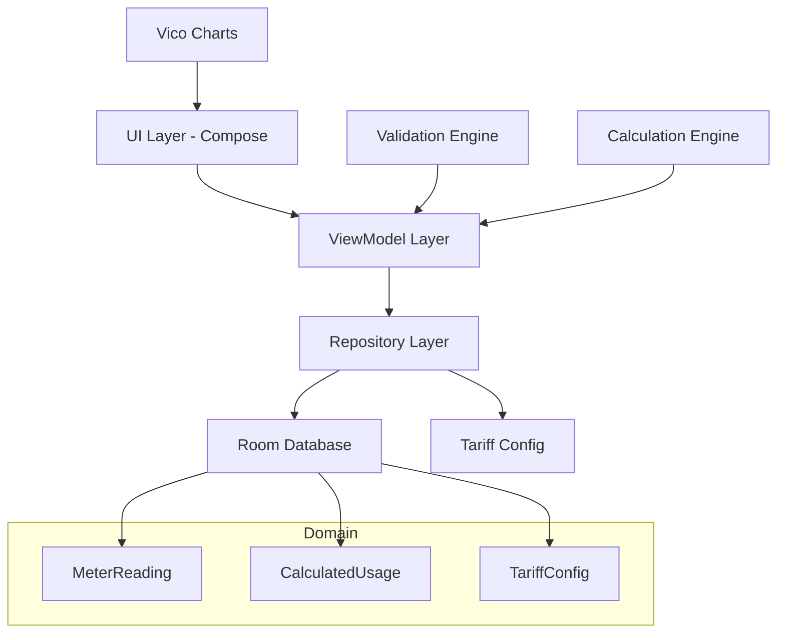

# LECO Smart Meter Analyzer - Active Context & Architecture Plan

## Project Overview

Build a modern Android application for electricity usage tracking and solar planning analysis using:
- **Kotlin** + **Jetpack Compose**
- **Material 3** design
- **MVVM Architecture**
- **Room Database** (offline-first)
- **Vico Charts** for analytics

---

## Phase 1: Core Logging App (MVP)

### Milestone 1.1: Project Foundation & Architecture

- [x] Create Android project skeleton with modern tooling
  - [x] Configure build.gradle with Kotlin, Compose, Room dependencies
  - [x] Set up Material 3 theme and color scheme
  - [x] Create package structure following clean architecture
  - [x] Configure Hilt dependency injection
  - [x] Set up navigation graph (Compose Navigation)

- [x] Design data layer architecture
  - [x] Create domain models (MeterReading, CalculatedUsage, TariffConfig)
  - [x] Define repository interfaces
  - [x] Plan database schema and relationships

### Milestone 1.2: Database Layer

- [x] Create Room database entities
  - [x] `MeterReadingEntity` - raw meter readings table
  - [x] `CalculatedUsageEntity` - derived usage calculations
  - [x] `TariffConfigEntity` - configurable tariff rates

- [x] Implement DAOs
  - [x] `MeterReadingDao` - CRUD operations for readings
  - [x] `CalculatedUsageDao` - usage calculation queries
  - [x] `TariffConfigDao` - tariff configuration queries

- [x] Build repository layer
  - [x] `MeterReadingRepository` - data access abstraction
  - [x] `CalculatedUsageRepository` - calculated usage management
  - [x] `TariffConfigRepository` - tariff management

### Milestone 1.3: Core Domain & Business Logic

- [x] Implement validation engine
  - [x] Reading non-decrease validation
  - [x] Total vs sum validation (Rate1 + Rate2 + Rate3)
  - [x] Duplicate timestamp detection
  - [x] Abnormal spike detection
  - [x] Modular validation rule system

- [x] Build calculation engine
  - [x] Usage delta calculations (consecutive readings)
  - [x] TOU category time window logic
  - [x] Cost estimation using tariff rates
  - [x] Fixed monthly charge handling

- [x] Add unit tests
  - [x] NonDecreaseValidationRuleTest
  - [x] SumCheckValidationRuleTest
  - [x] DuplicateTimestampValidationRuleTest
  - [x] SpikeDetectionValidationRuleTest
  - [x] ValidationEngineTest
  - [x] CalculationEngineTest
  - [x] TouCategoryTest

**Test Results**: All 70 unit tests passing

### Milestone 1.4: Data Entry UI

- [ ] Create Add Reading screen
  - [ ] Large numeric keypad for meter readings
  - [ ] Timestamp picker with smart defaults
  - [ ] All 4 reading input fields (Total, Rate1, Rate2, Rate3)
  - [ ] Notes field
  - [ ] Validation error display
  - [ ] Save/Cancel actions

- [ ] Implement ViewModel for entry screen
  - [ ] State management for form inputs
  - [ ] Validation state handling
  - [ ] Save operation with error handling

### Milestone 1.5: Dashboard & History

- [ ] Create Dashboard screen
  - [ ] Latest reading display
  - [ ] Daily usage summary
  - [ ] Estimated daily cost
  - [ ] Quick stats cards

- [ ] Create History screen
  - [ ] List of all readings
  - [ ] Swipe-to-edit/delete
  - [ ] Search/filter capability

- [ ] Create Reading Detail screen
  - [ ] Usage calculations display
  - [ ] Cost breakdown
  - [ ] Validation warnings

---

## Phase 2: Analytics & Graphs

### Milestone 2.1: Charting Infrastructure

- [ ] Integrate Vico Charts library
- [ ] Create chart data models
- [ ] Build reusable chart components

### Milestone 2.2: Analytics Screens

- [ ] Create Analytics screen
  - [ ] Daily usage line chart
  - [ ] Weekly trends bar+line chart
  - [ ] TOU comparison stacked bar

- [ ] Create Cost Analysis screen
  - [ ] Monthly projected bill
  - [ ] Cost trends line chart
  - [ ] TOU category breakdown

---

## Phase 3: Solar Planning (Future)

### Milestone 3.1: Solar Calculation Engine

- [ ] Average daily usage calculations
- [ ] Day vs night usage analysis
- [ ] Peak consumption analysis
- [ ] Solar offset estimation

### Milestone 3.2: Solar Planner UI

- [ ] Solar panel sizing calculator
- [ ] Battery bank estimator
- [ ] Inverter recommendation
- [ ] Grid dependency analysis

---

## Technical Architecture Diagram

---

## Database Schema

### MeterReadings Table
| Field | Type | Description |
|-------|------|-------------|
| id | Long (PK) | Auto-generated ID |
| timestamp | DateTime | Reading capture time |
| totalReading | Double | Cumulative total kWh |
| rate1Day | Double | Cumulative day usage kWh |
| rate2OffPeak | Double | Cumulative off-peak kWh |
| rate3Peak | Double | Cumulative peak kWh |
| notes | String | Optional user notes |
| createdAt | DateTime | Record creation time |

### CalculatedUsage Table
| Field | Type | Description |
|-------|------|-------------|
| id | Long (PK) | Auto-generated ID |
| fromReadingId | Long (FK) | Previous reading reference |
| toReadingId | Long (FK) | Current reading reference |
| totalUsed | Double | Delta total kWh |
| dayUsed | Double | Delta day usage kWh |
| offPeakUsed | Double | Delta off-peak kWh |
| peakUsed | Double | Delta peak kWh |
| estimatedCost | Double | Calculated cost |
| calculationTimestamp | DateTime | When calculated |

### TariffConfiguration Table
| Field | Type | Description |
|-------|------|-------------|
| id | Long (PK) | Auto-generated ID |
| dayRate | Double | LKR per kWh |
| offPeakRate | Double | LKR per kWh |
| peakRate | Double | LKR per kWh |
| fixedCharge | Double | Monthly fixed charge |
| effectiveDate | DateTime | When tariff becomes active |

---

## Validation Rules Summary

1. **Non-decrease**: New readings must be >= previous readings
2. **Sum check**: Total delta should equal Rate1 + Rate2 + Rate3 deltas
3. **Duplicate detection**: Warn on same timestamp
4. **Spike detection**: Warn on abnormal usage jumps
5. **Range check**: Detect impossible values

---

## TOU Time Windows

| Category | Time Window |
|----------|-------------|
| Off-Peak | 22:30 – 05:30 |
| Day | 05:30 – 18:30 |
| Peak | 18:30 – 22:30 |

---

## Decisions Made

Based on user feedback:

1. **MVP Scope**: Include Dashboard and History screens in Phase 1 for complete MVP
2. **Tariff Configuration**: User configures tariffs on first launch (no pre-populated defaults)
3. **Testing**: Include unit tests from the start for validation and calculation engines

---

## Current Status

- **Milestone 1.1**: COMPLETE - Project foundation with Hilt, Room, Navigation, and basic UI screens created
- **Milestone 1.2**: COMPLETE - Database layer with all entities, DAOs, and repositories implemented
- **Milestone 1.3**: COMPLETE - Core Domain & Business Logic (validation and calculation engines) implemented with unit tests
- **Next**: Milestone 1.4 - Data Entry UI

---

## Notes

- Vico Charts dependency temporarily disabled due to repository availability issues. Will be re-enabled when a stable version is available.
- All 70 unit tests passing successfully.