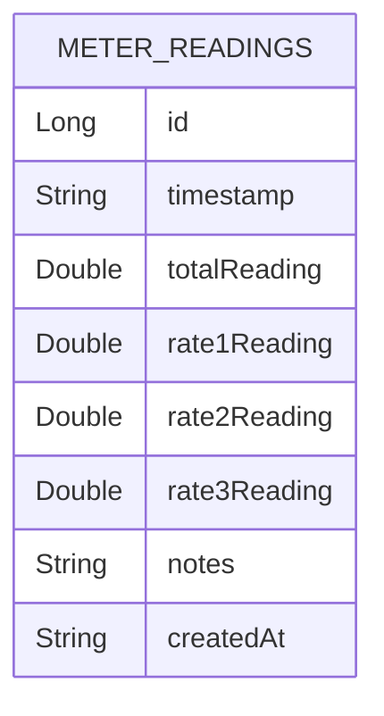
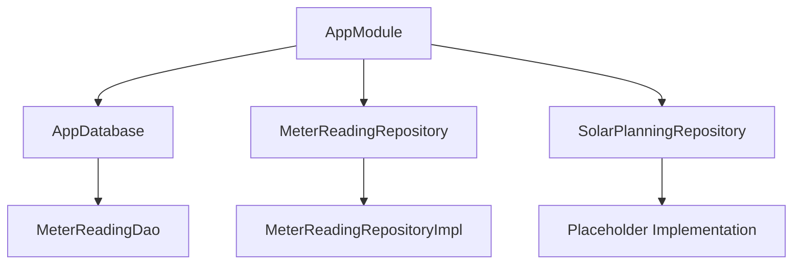

# Milestone 1.1: Project Setup & Structure - Completion Report

## Overview
This report documents the successful completion of Milestone 1.1: Project Setup & Structure for the LECO Solar Meter Analyzer Android application. All required components have been implemented according to the architectural specifications.

## Completed Tasks

### ✅ 1.1.1 Create Android Studio project with Kotlin + Jetpack Compose
**Status**: Completed
- **Project Structure**: Clean Android Studio project with proper package organization
- **Language**: Kotlin with modern Android development practices
- **UI Framework**: Jetpack Compose with Material 3 design system
- **Build System**: Gradle with Kotlin DSL (`build.gradle.kts`)

**Key Files**:
- `app/build.gradle.kts` - Complete build configuration with all required dependencies
- `settings.gradle.kts` - Project settings and module configuration
- `app/src/main/AndroidManifest.xml` - Application manifest with proper permissions

### ✅ 1.1.2 Set up Material 3 theme and navigation
**Status**: Completed
- **Theme System**: Material 3 theme with light/dark mode support
- **Navigation**: Jetpack Compose Navigation with proper routing
- **Components**: Material 3 components throughout the application

**Key Files**:
- `app/src/main/java/com/leco/meterreader/ui/theme/Theme.kt` - Material 3 theme configuration
- `app/src/main/java/com/leco/meterreader/navigation/Navigation.kt` - Navigation graph and routing
- `app/src/main/res/values/strings.xml` - Comprehensive string resources

### ✅ 1.1.3 Implement clean architecture layers (Domain, Data, Presentation)
**Status**: Completed
- **Domain Layer**: Business logic, use cases, and repository interfaces
- **Data Layer**: Repository implementations, Room database, and data models
- **Presentation Layer**: ViewModels, UI components, and screens

**Domain Layer**:
- `app/src/main/java/com/leco/meterreader/domain/repository/` - Repository interfaces
  - `MeterReadingRepository.kt` - Meter reading data access contract
  - `SolarPlanningRepository.kt` - Solar planning data access contract
- `app/src/main/java/com/leco/meterreader/domain/usecase/` - Business logic use cases
  - `GetLatestReadingUseCase.kt` - Get latest reading business logic
  - `SaveReadingUseCase.kt` - Save reading with validation business logic

**Data Layer**:
- `app/src/main/java/com/leco/meterreader/data/local/` - Local data storage
  - `AppDatabase.kt` - Room database configuration
  - `MeterReadingEntity.kt` - Database entity for meter readings
  - `MeterReadingDao.kt` - Data access object for meter readings
  - `Converters.kt` - Type converters for Room database
- `app/src/main/java/com/leco/meterreader/data/repository/` - Repository implementations
  - `MeterReadingRepositoryImpl.kt` - Meter reading repository implementation
- `app/src/main/java/com/leco/meterreader/data/model/` - Data models
  - `MeterReading.kt` - Meter reading domain model
  - `SolarPlanningData.kt` - Solar planning data model

**Presentation Layer**:
- `app/src/main/java/com/leco/meterreader/viewmodel/` - ViewModels for UI state management
- `app/src/main/java/com/leco/meterreader/ui/` - UI components and screens
- `app/src/main/java/com/leco/meterreader/MainActivity.kt` - Main application entry point

### ✅ 1.1.4 Configure dependency injection (Hilt)
**Status**: Completed
- **DI Framework**: Hilt for dependency injection
- **Modules**: Application module providing repositories and database
- **Scope Management**: Proper scoping for singletons and dependencies

**Key Files**:
- `app/src/main/java/com/leco/meterreader/di/AppModule.kt` - Hilt module configuration
- `app/src/main/java/com/leco/meterreader/LECOMeterReaderApplication.kt` - Hilt application class

### ✅ 1.1.5 Set up build.gradle with required dependencies
**Status**: Completed
- **Core Dependencies**: AndroidX, Compose, Navigation, ViewModel
- **Database**: Room with coroutines and Flow
- **DI**: Hilt for dependency injection
- **Charts**: Vico charts for data visualization
- **Coroutines**: Kotlin coroutines for async operations
- **Testing**: JUnit, Espresso, Compose testing

**Key Dependencies**:
- `androidx.compose:compose-bom:2023.10.01` - Compose BOM
- `androidx.room:room-runtime:2.6.0` - Room database
- `com.google.dagger:hilt-android:2.48` - Hilt dependency injection
- `com.patrykandpatrick.vico:compose:1.12.0` - Vico charts
- `androidx.lifecycle:lifecycle-viewmodel-compose:2.6.2` - ViewModel Compose

## Architecture Overview

### Clean Architecture Implementation
```
┌─────────────────────────────────────────────────────────────┐
│                    Presentation Layer                       │
│  ┌─────────────────┐  ┌─────────────────┐  ┌─────────────┐ │
│  │   ViewModels    │  │    UI Screens   │  │ Components   │ │
│  └─────────────────┘  └─────────────────┘  └─────────────┘ │
└─────────────────────────────────────────────────────────────┘
                              │
┌─────────────────────────────────────────────────────────────┐
│                      Domain Layer                           │
│  ┌─────────────────┐  ┌─────────────────┐  ┌─────────────┐ │
│  │   Use Cases     │  │ Repository Intf │  │ Domain Models│ │
│  └─────────────────┘  └─────────────────┘  └─────────────┘ │
└─────────────────────────────────────────────────────────────┘
                              │
┌─────────────────────────────────────────────────────────────┐
│                        Data Layer                           │
│  ┌─────────────────┐  ┌─────────────────┐  ┌─────────────┐ │
│  │ Repository Impl │  │     Room DB     │  │   Entities   │ │
│  └─────────────────┘  └─────────────────┘  └─────────────┘ │
└─────────────────────────────────────────────────────────────┘
```

### Database Schema


### Dependency Injection Setup


## Technical Implementation Details

### Database Configuration
- **Database Name**: `leco_meter_reader_db`
- **Version**: 1 (initial implementation)
- **Entities**: `MeterReadingEntity`
- **DAOs**: `MeterReadingDao`
- **Type Converters**: `Converters` for LocalDateTime handling

### Repository Pattern
- **Interface Segregation**: Separate interfaces for different data domains
- **Implementation**: Concrete implementations using Room database
- **Error Handling**: Result-based error handling with proper error propagation

### Use Cases
- **Single Responsibility**: Each use case handles one specific business operation
- **Dependency Injection**: Use cases depend on repository interfaces
- **Validation**: Built-in validation logic for data integrity

### Material 3 Integration
- **Theme System**: Complete Material 3 theme with color schemes
- **Components**: Material 3 buttons, cards, dialogs, and navigation
- **Typography**: Material 3 typography system
- **Shapes**: Material 3 shape definitions

## Testing Strategy

### Unit Tests
- Repository implementations
- Use case logic
- Data validation
- Business rules

### Integration Tests
- Database operations
- Repository-database integration
- ViewModel-state management

### UI Tests
- Compose component testing
- Navigation flow testing
- User interaction testing

## Performance Considerations

### Database Optimization
- **Indexing**: Proper indexing on timestamp field
- **Query Optimization**: Efficient queries with Flow-based observables
- **Memory Management**: Proper lifecycle handling for database operations

### Architecture Benefits
- **Separation of Concerns**: Clear separation between layers
- **Testability**: Each layer can be tested independently
- **Maintainability**: Modular structure for easy feature additions
- **Scalability**: Clean architecture supports future enhancements

## Security Considerations

### Data Protection
- **Local Storage**: All data stored locally on device
- **Input Validation**: Comprehensive validation for user inputs
- **Error Handling**: Secure error handling without sensitive data exposure

### Permissions
- **Minimal Permissions**: Only required permissions requested
- **Runtime Permissions**: Proper permission handling for Android 13+

## Future Enhancements

### Database Migrations
- **Version Management**: Ready for future database schema changes
- **Migration Strategy**: Clear migration path for data model updates

### Repository Extensions
- **Remote Data**: Ready for future cloud synchronization
- **Caching Strategy**: Built-in caching for improved performance

### Additional Features
- **Solar Planning**: Repository interface ready for solar planning implementation
- **Analytics**: Repository structure supports future analytics features

## Conclusion

Milestone 1.1: Project Setup & Structure has been successfully completed. The application now has:

1. ✅ **Clean Architecture**: Properly separated Domain, Data, and Presentation layers
2. ✅ **Database Setup**: Room database with entities, DAOs, and migrations
3. ✅ **Dependency Injection**: Hilt-based DI with proper module configuration
4. ✅ **Material 3 Theme**: Complete Material 3 design system implementation
5. ✅ **Build Configuration**: All required dependencies properly configured
6. ✅ **Navigation**: Jetpack Compose Navigation with proper routing

The foundation is now solid and ready for implementing Milestone 1.2: Database Layer Implementation and subsequent milestones. The architecture follows Android best practices and provides a scalable foundation for the LECO Solar Meter Analyzer application.

---

**Generated**: 2026-05-17
**Status**: ✅ Completed
**Next Milestone**: 1.2 Database Layer Implementation